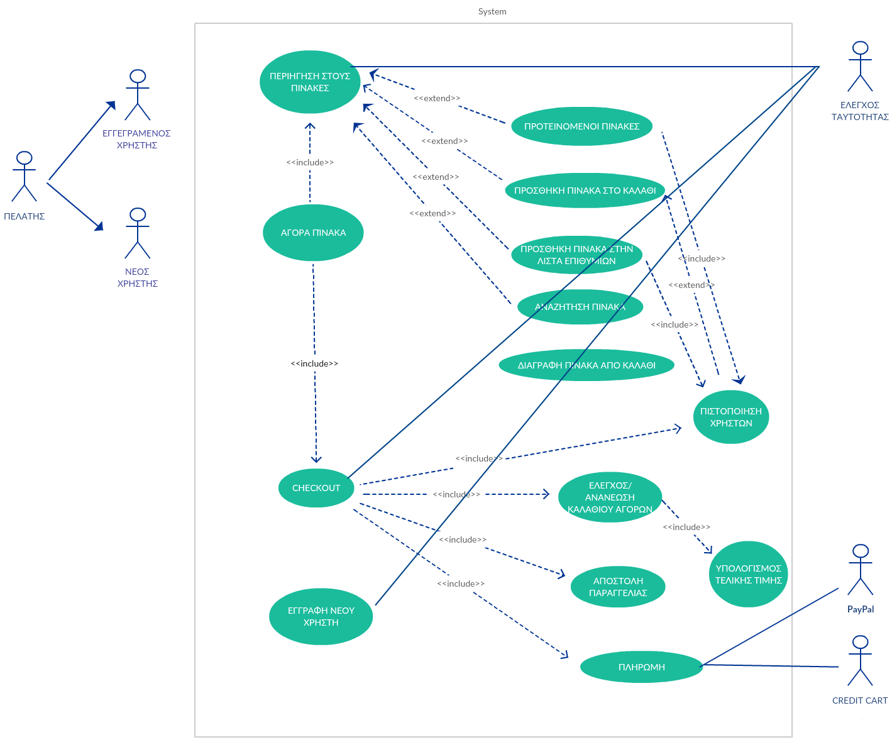

# User Requirement Specifications

## Λειτουργικές Απαιτήσεις (ΛΑ):
Αποτελούν δηλώσεις που ορίζουν ποιες υπηρεσίες θα πρέπει να προσφέρει το σύστημα και πώς να αντιδρά σε συγκεκριμένες εισόδους και σε συγκεκριμένες καταστάσεις. Καθορίζουν τις αναγκαίες και απαραίτητες λειτουργίες που πρέπει (musts) να παρέχονται από το σύστημα, αλλά και τις επιθυμητές (wants) απαιτήσεις από το σύστημα. Οι απαιτήσεις χρήστη κρίνονται ως ουσιώδη για την επιτυχή περιγραφή, υλοποίηση και σωστή λειτουργία του συστήματος. 

Παρακάτω ακολουθούν συγκεκριμένες λειτουργικές απαιτήσεις του συστήματος, με κάθε λειτουργική απαίτηση να περιέχει τα ακόλουθα χαρακτηριστικά:

1. ID - Μοναδικός αριθμός ταυτότητας της λειτουργικής απαίτησης

2. Περιγραφή - συνοπτική λεκτική ανάλυση της λειτουργικής απαίτησης 

3. User Priority - περιγράφει πόσο σημαντικό θα είναι για τον πελάτη να περιέχεται στο σύστημα (ουσιώδη, σημαντικό, χρήσιμο)

4. Technical Priority - περιγράφει πόσο σημαντικό είναι για την αρχιτεκτονική του συστήματος

5. Stability - περιγράφει την πιθανότητα να αλλάξει

Σημειώνεται ότι για τα υπ΄αριθ. 3 έως και 5 χαρακτηριστικά, η κλίμακα βαθμολόγησης της σπουδαιότητας είναι από 0/5 έως 5/5.   

### ΛΑ-1

Οι πιστοποιημένοι χρήστες πρέπει να μπορούν να εισέρχονται στο σύστημα (*LogIn*) και να εξέρχονται (*LogOut*).

* **Περιγραφή:** Είναι η διαδικασία κατά την οποία ο χρήστης αναγνωρίζεται από το σύστημα σε κάθε επόμενη επίσκεψη του (μετά από την εγγραφή του) και αποτελεί έναν αποτελεσματικό και ασφαλή τρόπο για να ξεπερασθεί το πρόβλημα του προσδιορισμού του ίδιου του χρήστη που εισέρχεται στην ιστοσελίδα του e-shop από διαφορετικά IPs ή να διακρίνει διαφορετικούς χρήστες που χρησιμοπιούν την ίδια IP. Η αναγνώριση γίνεται με την εισαγωγή του ονόματος του χρήστη (*User Name*) και τοu κωδικού πρόσβασης (*Password*).

* **User Priority: (5/5)** Οι διαδικασίες εισόδου και εξόδου είναι απαραίτητες για την ασφαλή χρήση του e-shop. Το σύστημα αναγνωρίζει τον χρήστη και βάση της κατηγορίας του παρέχονται δικαιώματα και περιορισμοί.

* **Technical Priority: (4/5)** Οι διαδικασίες εισόδου και εξόδου αποτελούν αναπόσπαστο κομμάτι της σωστής και ασφαλής λειτουργίας του συστήματος. Με τη λειτουργία αυτή διασφαλίζεται η αξιοπιστία κατά την χρήση, καθώς αποφεύγεται η μη διαπιστευμένη χρήση.

* **Stability: (3/5)** Η συγκεκριμένη λειτουργική απαίτηση θα πρέπει να λαμβάνει υπόψιν ότι η διαδικασία αυθεντικοποίησης των χρηστών ενδέχεται να αλλάξει, καθώς είναι δυνατό να προστεθεί μελλοντικά η είσοδος στο σύστημα μέσω λογαριασμών σε κοινωνικά μέσα δικτύωσης (Facebook, Google+ etc).

### ΛΑ-2

Τα επιλεγμένα προϊόντα του πελάτη πρέπει να εισάγονται σε ένα καλάθι αγορών.

* **Περιγραφή:** Το καλάθι των αγορών είναι απαραίτητο για την ομαλή έκβαση της αγοράς. Περιλαμβάνει την λίστα με τα έργα τέχνης που έχουν επιλέξει οι χρήστες, καθώς και μία λεπτομερή ανάλυση του συνολικού κόστους. 

* **User Priority(5/5):** Το καλάθι αγορών αποτελεί κατεξοχήν εργαλείο για τους χρήστες του e-shop. Ο χρήστης μπορεί να ελέγχει και να τροποποιεί οποιαδήποτε στιγμή την παραγγελία του, να ενημερώνεται για το συνολικό κόστος κτλ.

* **Τechnical Priority(5/5):** Από τεχνικής πλευράς το καλάθι αγορών αποτελεί αναπόσπαστο κομμάτι του e-shop, καθώς συμπεριλαμβάνεται άμεσα στην όλη διαδικασία αγορά ενός πίνακα. Η ΛΑ-2 ανάγει στο σύστημα μας ένα πλήρες εργαλείο για τη διαχείριση των παραγγελιών. Δίχως αυτή (ΛΑ-2) η βασική λειτουργία του e-shop, που είναι η αγορά και πώληση έργων τέχνης δεν θα μπορούσε να υλοποιηθεί. 

* **Stability(4/5):** Είναι απαραίτητη η οπτική ένδειξη του καλαθιού αγορών. Η ένδειξη της λίστας των πινάκων που έχουν επιλεχθεί ή όχι θα εμφανίζεται με συγκεκριμένο τρόπο, ο οποίος όμως είναι δυνατό να τροποποιηθεί μελλοντικά με την πιθανή ανάπτυξη συνεργασιών με άλλα eshops (eBay, skroutz.gr etc). 

### ΛΑ-3

Το σύστημα πρέπει να δείχνει σε όλους τους χρήστες τη διαθεσιμότητα των προϊόντων.

* **Περιγραφή:** Είναι η διαδικασία που ενημερώνει τους χρήστες εάν κάποιο προϊόν είναι άμεσα διαθέσιμο προς πώληση ή θα πρέπει να γίνει αρχικά κάποια παραγγελία. Ουσιαστικά πληροφορεί τους χρήστες εάν θα αποσταλεί άμεσα το προϊόν σε περίπτωση αγοράς.

* **User Priority (5/5):** Είναι απαραίτητο να γνωρίζει ο χρήστης εάν μετά την επιτυχή παραγγελία του προϊόντος, θα σταλεί άμεσα ή θα χρειαστεί να περιμένει ένα εύλογο χρονικό διάστημα μέχρι να ολοκληρωθεί η αποστολή του προϊόντος. Για την επιτυχία του eshop πρέπει να ληφθεί υπόψιν η συγκεκριμένη λειτουργική απαίτηση, καθώς οι διαδικτυακές αγορές απαιτούν αμεσότητα, ευκολία και μη χρονοβόρες διαδικασίες κατά την παραγγελία και αποστολή των προϊόντων. Ουσιαστικά αντανακλά την αξιοπιστία του eshop.

* **Technical Priority (4/5):** Αποτελεί σημαντικό κομμάτι του συστήματος, καθώς το eshop συνδέεται άμεσα με την εφοδιαστική αλυσίδα και θα πρέπει να ενημερώνονται όλοι οι χρήστες (επισκέπτες, πελάτες, προμηθευτές και διαχειριστές) για τα αποθεματικά των προϊόντων, επιδιώκοντας την βέλτιστη επιλογή των αποθεματικών με στόχο την αύξηση του κέρδους και τη μείωση του κόστους.

* **Stability (3/5) :** Η συγκεκριμένη λειτουργική απαίτηση είναι αναπόσπαστο μέρος του συστήματος και θα πρέπει να ληφθεί υπόψιν η μελλοντική σύνδεση του συστήματος με εξωτερική βάση δεδομένων νέων προμηθευτών ή νέων συνεργατών.

### ΛΑ-4
Ο πελάτης μετά την παραλαβή των έργων προχωρά στην αξιολόγηση τους 

* **Περιγραφή:** Είναι πολύ σημαντικό για την ομαλή λειτουργία της υπηρεσίας να δίνεται η δυνατότητα αξιολόγησης στους πελάτες. Η αξιολόγηση θα υποβάλεται αμέσως μετά την παραλαβή των έργων και αποτελεί ένα μέτρο απόδοσης. Ακόμη και σε περιπτώσεις που η αξιόλογηση δεν είναι η επιθυμητή (αρνητικά σχόλια) ο διαχειριστής επικοινωνεί άμεσα με τον πελάτη και διορθώνει το πρόβλημα.

* **User Priority (5/5):** Είναι ευρέως διαδεδομένη στο πλαίσιο των ηλεκτρονικών αγορών. Η συγκεκριμένη απαίτηση δίνει το αίσθημα της ελευθερίας στους πελάτες να εκφράσουν την γνώμη τους και ταυτόχρονα αποτελεί ένα είδος feedback προς την ίδια την υπηρεσία, η οποία προβαίνει σε πιθανές βελτιώσεις. Αξίζει να σημειωθεί ότι οι πωλητές μπορούν να αυξήσουν σημαντικά την επιτυχία (αύξηση εμπιστοσύνης, χαμηλότερο ποσοστό επιστροφών, υψηλότερα conversion rates) των διαδικτυακών πωλήσεων τους.

* **Technical Priority (4/5):** Οι αξιολογήσεις των πελατών εμφανίζονται μέσω μιας μικροεφαρμογής (widget) απευθείας στη σελίδα του ηλεκτρονικού καταστήματος. Το σύστημα διαχειρίζεται από εξωτερικό πάροχο αντιστοίχων υπηρεσιών, ο οποίος είναι υπεύθυνος για την αξιοπιστία των αξιολογήσεων.Κρίνεται απαραίτητη μια δομημένη σύνοψη με τις σημαντικότερες πληροφορίες, όπως συνολική αξιολόγηση, αριθμός αξιολογήσεων, αρνητικές αξιολογήσεις, θετικές αξιολογήσεις, τιμή, θέση κατάταξης στην αντίστοιχη κατηγορία, φύλο, lifestyle και χρήση.

* **Stability (3/5) :** Υπάρχουν διάφορα συστήματα αξιολόγησης προϊόντων-υπηρεσιών, συνεπώς η αξιολόγηση θα μπορούσε να γίνει έιτε μέσα από πλατφόρμες οι οποίες συνδέονται με μηχανές σύγκρισης τιμών (βλέπε π.χ. skroutz.gr), είτε από αυτο-προγραμματιζόμενα συστήματα (ο διαχειριστής της υπηρεσίας επιλέγει τις αξιολογήσεις που θα δημοσιευθούν).

### ΛΑ-5 

Οι χρήστες πρέπει να μπορούν να κάνουν αναζήτηση έργων χρησιμοποιόντας λέξεις κλειδιά

* **Περιγραφή:** Ο χρήστης έχει την δυνατοτήτα να αναζητήση τον πίνακα που επιθυμεί εισάγωντας λέξεις κλειδιά όπως το όνομα του δημιουργού, τον τύπο της κατασκευής, την κατηγορία του πίνακα κτλ.

* **User Priority:(5/5)** Η συγκεκριμένη απαίτηση είναι ουσιώδη για τον χρήστη καθώς πετυχαίνεται άμεση και εύκολη αναζήτηση από τους υποψήφιους πελάτες. 

* **Τechnical difficulty:(5/5)**Αποτελεί ανaπόσπαστο κομμάτι της αρχιτεκτονικής του συστήματός μας.Σε κάθε σελίδα του e-shop θα προβάλεται η επιλογή της αναζήτησης. 

* **Stability(3/5):**Γενικότερα ο τρόπος αναζήτησης των προϊόντων συνεχώς μεταββάλεται. Αρχικά η αναζήτηση διεξάγονταν μόνο μέσα από συγκεκριμένες κατηγορίες, στην συνέχεια προτάθηκαν μέθοδοι όπως η γρηγόρη αναζήτηση (ο πελάτης δίνει ένα όρισμα την φορά) και η απλή αναζήτηση που χρησιμοποιούμε στο σύστημα μας. Θα μπορούσε ο χρήστης να συμπληρώνει και άλλα πεδία ή να χρησιμοποιεί και λογικούς τελεστές (πχ.AND, OR,NOT κτλ.) όπως γίνεται σε μία σύνθετη αναζήτηση με την μορφή φίλτρων αναζήτησης. 

### ΛΑ-6 

Οι χρήστες να μπορούν να βλέπουν μία μεγένθυση της φωτογραφίας ενός προϊόντος.

* **Περιγραφή:** Η ΛΑ-6 δίνει στον χρήστη την επιλογή της μεγένθυνσης ενός πίνακα ώστε να μπορέσει να διακρίνει καλύτερα τα χαρακτηριστικά του.

* **User Priority (4/5):** Αρκετά σημαντική λειτουργία για τον χρήστη-πελάτη.Μέσω της συγκεκριμένης απαίτησης δίνεται στον χρήστη μία αναλυτική προεπισκόπιση του έργου που θέλει να αγοράσει. Προβάλονται καλύτερα τα χαρακτηριστικά και οι λεπτομέριες του πίνακα.

* **Technical Priority (4/5):**Σε κάθε έργο θα πρέπει να υπάρχει η δυνατότητα μεγένθυσης. Η ηλεκτρονική πώληση πινάκων απαιτεί την ύπαρξη της ΛΑ-5 διότι η προώθηση και κατ' επέκταση η πώληση έργων τέχνης στηρίζεται στην λεπτομέρια.

* **Stability (3/5) :** Η λειτουργία μεγένθυσης μπορεί να ενσωματωθεί και σε άλλες λειτουργίες όπως η 3D απεικόνηση ενός έργου, η ακόμη και σε επιλογές εμφάνισης ανάλογα με το χρώμα του τείχου που θα τοποθετηθεί ο πίνακας.  

### ΛΑ-7

Οι χρήστες πρέπει να μπορούν να βλέπουν την περιγραφή ενός έργου τέχνης.

* **Περιγραφή:** Στο ηλεκτρονικό εμπόριο η περιγραφή των έργων αποτελεί σημαντικό παράγοντα τόσο στην προώθηση του έργου όσο και στην σαφή ενημέρωση του πελάτη. Η περιγραφή του έργου γίνεται από τον δημιουργό του ο οποίος παραθέτει πληροφορίες για την τεχνική σχεδίασης, τις διαστάσεις του κτλ.

* **User Priority (5/5):** Η συγκεκριμένη απαίτηση ενημερώνει τον πελάτη σχετικά με όλες τις πληροφορίες που απαιτούνται ώστε να περιγραφεί το έργο όσο το δυνατό καλύτερα γίνεται. Είναι πολύ σημαντική η σαφή και περιεκτική περιγραφή καθώς αποτελεί μια μορφή προώθησης του έργου και συνδέεται άρρηκτα με τς πωλήσεις. Στόχος είναι ο δημιουργός να παρουσιάσει τα πιο σημαντικά γνωρίσματα του έργου, αναδεικνύοντας το συναισθηματικό και προσωπικό κέρδος που θα έχει ο πελάτης αν το αγοράσει.

* **Technical Priority (4/5):** Αρκετά χρήσιμο από τεχνικής άποψης, καθώς η περιγραφή συνδέεται άμεσα με το έργο προς πώληση.

* **Stability ( 3/5) :** Σε κάθε έργο αντοιστιχεί μία γραπτή περιγραφή των λεπτομεριών. Στο σύστημα μας οι λεπτομέριες αναγράγονται πάνω και δεξιά από την φωτογραφία του πίνακα, παρόλα αυτά υπάρχουν αρκετές ενναλακτικές τόσο στην τοποθεσία της περιγραφής όσο και στα χαρακτηριστικά που θα περιλαμβάνει.

### ΛΑ-8

Οι επισκέπτες θα πρέπει να έχουν τη δυνατότητα να εγγραφούν στο σύστημα, δίνοντας τις απαραίτητες πληροφορίες και να επιλέξουν τα στοιχεία που απαιτούνται για την είσοδο στο σύστημα (username, password).

* **Περιγραφή:** Είναι η διαδικασία που οι επισκέπτες στην ιστοσελίδα που δεν διαθέτουν έγκυρο λογαριασμό για την είσοδο στο σύστημα, να τους δίνεται η δυνατότητα να εγγράφονται στο σύστημα, δίνοντας τα απαραίτητα στοιχεία τους (στοιχεία ταυτότητας, στοιχεία επικοινωνίας, στοιχεία διαμονής κλπ), ώστε μετά την επιτυχή ολοκλήρωση της εγγραφής να μπορούν με τα στοιχεία που δήλωσαν να εισέλθουν στο σύστημα.

* **User Priority (5/5):** Απαραίτητο για την εγγραφή νέων χρηστών - πελατών στο σύστημα. Ουσιώδη λειτουργία τον χρήστη, που του δίνεται άμεσα η δυνατότητα να εγγραφεί στο σύστημα και να ολοκληρώσει την παραγγελία του.

* **Technical Priority (5/5):** Σημαντικό από τεχνικής άποψης, καθώς αποτελεί τον πυρήνα του σχεδιασμού του συστήματος.

* **Stability (3/5) :** Σχεδιαστικά να λαμβάνει υπόψιν την μελλοντική σύνδεση μέσω key-id, όπως είναι το Facebook Account, όπου πλέον οι χρήστες συνδέονται απευθείας και τα αιτούμενα στοιχεία στέλνονται αυτόματα. 

### ΛΑ-9
Οι χρήστες πρέπει να μπορούν να επικοινωνούν με το e-shop

* **Περιγραφή:** Οι χρήστες του e-shop έχουν την δυνατότητα να υποβάλουν τις ερωτήσεις του άμεσα μεσω e-mail

* **User Priority (5/5):** Πρέπει να παρέχεται η δυνατότητα άμεσης εποικωνίας στους χρήστες μέσω e-mail. Κ συγκεκριμένη απαίτηση παρέχει την δυνατότητα στον χρήστη να εποικοινωνήσει άμεσα για οτιδήποτε θέλει να ενημερωθεί.

* **Technical Priority (5/5):** Ουσιώδη για την αρχιτεκτονική του συστήματος καθώς η δυνατότητα άμεσης επικοινωνίας με τους χρήστες αποτελεί δομικό χαρακτηριστικό κάθε ηλεκτρονικής υπηρεσίας.

* **Stability (4/5) :** Η δυνατότητα άμεσης εποικωνίας θα πρέπει να υπάρχει, παρόλα αυτά ο τρόπος διεξαγωγής της είναι σχετικά ευμετάβλητος καθώς εξαρτάται από τα ηλεκτρονικά μέσα εποικωνίας που χρησιμοποιούνται. Συνήθως σε τέτοιου είδους συστήματα χρησιμοποιείται το e-mail.

### ΛΑ-10

Οι πελάτες και επισκέπτες πρέπει να έχουν τη δυνατότητα να επεξεργάζονται τα στοχεία από το καλάθι αγορών τους.

* **Περιγραφή:** Στους χρήστες παρέχεται η επιλογή να τροποποιούν ή να διαγράφουν τις ποσότητες από τα επιλεγμένα προϊόντα ή και να διαγράφουν μέρος ή όλα τα προϊόντα που περιέχονται στο καλάθι αγορών. Δηλαδή έχουν τον πλήρη έλεγχο στο καλάθι των αγορών τους, που περιλαμβάνει την προσθήκη, την τροποποίηση και τη διαγραφή προϊόντων, με ταυτόχρονη ενημέρωση του κόστους και της περιγραφής των προϊόντων μετά από κάθε αλλαγή στο καλάθι αγορών. 

* **User Priority (5/5):** Ουσιώδη για τον χρήστη, καθώς έχει τον πλήρη έλεγχο στο καλάθι αγορών. Για την επιτυχία του e-shop και την αποδοχή από τους χρήστες είναι ουσιώδης η υλοποίηση του.

* **Technical Priority (4/5):** Σημαντικό για το σύστημα, καθώς περιλαμβάνεται στην κεντρική αρχιτεκτονική του συστήματος και τον σχεδιασμό των βάσεων δεδομένων του συστήματος.

* **Stability (5/5) :** Παρέχει την οπτικοποίηση των επιλογών του χρήστη και είναι σημαντικό για την ευκολία χρήσης του συστήματος, παρέχοντας φιλικό περιβάλλον προς τον χρήστη (User Friendly Interface). Αποτελεί αναπόσπαστο στοιχείο του συστήματος και εκτιμάται ότι μελλοντικά δεν θα τροποποιηθεί.

### ΛΑ-11

Οι πελάτες θα έπρεπε να παρακολοθούν την πορεία της παραγγελίας τους.

* **Περιγραφή:** Είναι η διαδικασία που δίνεται η δυνατότητα στους πιστοποιημένους χρήστες να ενημερώνονται και να πληροφορούνται για την πορεία της παραγγελίας τους. Μέσω του λογαριασμού που έχουν δημιουργήσει στο σύστημα, θα έπρεπε να παρέχονται πληροφορίες από την επιτυχή καταγραφή της παραγγελίας, μέχρι την τελική αποστολή των προϊόντων.

* **User Priority (3/5):** Είναι χρήσιμο για τον πιστοποιημένο χρήστη να γνωρίζει τον χρόνο αποστολής και τον εκτιμώμενο χρόνο παραλαβής των προϊόντων. Αυξάνει την αξιοπιστία με τον πελάτη και είναι πιο πιθανό να μείνει ευχαριστημένος.

* **Technical Priority (3/5):** Χρήσιμο κομμάτι στη συνολική αρχιτεκτονική του συστήματος, που συνδέει βασικές λειτουργίες του συστήματος.

* **Stability (4/5) :** Οπτικοποιεί χρήσιμες πληροφορίες για τους πιστοποιημένους χρήστες. Είναι δυνατή η μελλοντική του τροποποίηση με διασύνδεση με εταιρείες μεταφορών για την real-time κατάσταση της παραγγελίας.

### ΛΑ-12

Οι διαχειριστές πρέπει να μπορούν να έχουν πρόσβαση στις αγορές όλων των πελατών.

* **Περιγραφή:** Είναι η διαδικασία που δίνεται η δυνατότητα στους διαχειριστές να έχουν έλεγχο και πρόσβαση σε όλες τις αγορές που έγιναν από όλους τους χρήστες. Να εμφανίζονται οι ποσότητες και το είδος των προϊόντων που αγοράστηκαν, καθώς και η κατάσταση των παραγγελιών.

* **User Priority (5/5):** Ουσιώδη για την σωστή λειτουργία του συστήματος, καθώς οι διαχειριστές πρέπει να έχουν έλεγχο σε όλες τις αγορές που έγιναν, καθώς είναι και ο βασικός στόχος υλοποίησης της e-shop.

* **Technical Priority (5/5):** Πολύ σημαντικό για την αρχιτεκτονική του συστήματος, που πρέπει να υλοποιηθεί με βάση τον κεντρικό έλεγχο των διαχειριστών επί των συνολικών αγορών που έχουν γίνει.

* **Stability (5/5) :** Δίνει πολύ χρήσιμες πληροφορίες και δεν εκτιμάται ότι θα έχει αλλαγές μελλοντικά.

### ΛΑ-13

Οι πωλητές πρέπει να μπορούν να έχουν πρόσβαση στα στοιχεία των πωλήσεων των προϊόντων τους. 

* **Περιγραφή:** Είναι η διαδικασία που δίνει πληροφορίες στους πωλητές για τα ποιά και πόσα προϊόντα τους έχουν αγοραστεί από τους πελάτες, χωρίς όμως να μπορούν να έχουν πρόσβαση στα δεδομένα του πελάτη, παρά μόνο στο γεωγραφικό διαμέρισμα που έγινε η αποστολή των προϊόντων.

* **User Priority (4/5):** Είναι σημαντικό για τους πωλητές να γνωρίζουν πόσα και ποια προϊόντα τους έχουν αγοραστεί από τους πελάτες. 

* **Technical Priority (4/5):** Περιλαμβάνεται στην βασική αρχιτεκτονική του συστήματος που πρέπει να υλοποιηθεί και η σχεδίαση του είναι σημαντική για την επιτυχή επίτευξη του στόχου του συστήματος.

* **Stability (5/5) :** Δίνει χρήσιμες πληροφορίες και δεν εκτιμάται ότι θα έχει αλλαγές μελλοντικά.

### ΛΑ-14

Οι πωλητές πρέπει να μπορούν να προσθέτουν έργα τέχνης στην ιστοσελίδα. 

* **Περιγραφή:** Είναι η διαδικασία που δίνει τη δυνατότητα στους πωλητές να προσθέτουν τα προϊόντα τους στην ιστοσελίδα, όπως και τη διαθέσιμη ποσότητα των προς πώληση προϊόντων.

* **User Priority (5/5):** Είναι ουσιώδη διαδικασία, καθώς αποτελεί τον πυρήνα λειτουργίας του e-shop.

* **Technical Priority (5/5):** Αναπόσπαστο κομμάτι της βασικής αρχιτεκτονικής του συστήματος.

* **Stability (3/5) :** Πολύ σημαντικό για την επιτυχή λειτουργία της ιστοσελίδας, ωστόσο μελλοντικά είναι δυνατή η απευθείας εισαγωγή προϊοντων από άλλες διαδικτυακές πλατφόρμες (eBay).

### ΛΑ-15

Οι διαχειριστές πρέπει να μπορούν να εγκρίνουν τα έργα τέχνης που έχουν αναρτηθεί από τους πωλητές.

* **Περιγραφή:** Είναι η διαδικασία κατά την οποία ελέγχονται τα έργα τέχνης που έχουν αναρτήσει οι πωλητές και εφόσον διαπιστωθεί ότι τηρούν τις προϋποθέσεις που έχουν τεθεί από την πολιτική της εταιρείας, τότε θα είναι πλέον διαθέσιμα προς εμφάνιση στην ιστοσελίδα και συνεπώς θα μπορούν να αγοραστούν από τους πελάτες.

* **User Priority (4/5):** Είναι σημαντική λειτουργία για την εκτέλεση της ορθής πολιτικής της ιστοσελίδας και την αύξηση της αξιοπιστίας του συστήματος. Επειδή αναφερόμαστε σε διαδικτυακές πωλήσεις, ο έλεγχος των προϊόντων προς πώληση και των ορθών στοιχείων που τα συνοδεύουν, είναι κρίσιμα στοιχεία για την αύξηση εμπιστοσύνης των πελατών στις διαδικτυακές αγορές.

* **Technical Priority (4/5):** Σημαντική λειτουργία του συστήματος, που πρέπει να περιλαμβάνεται στη βασική αρχιτεκτονική του συστήματος.

* **Stability (4/5) :** Η αρχική υλοποίηση της θα παραμείνει σχετικά αμετάβλητη μελλοντικά. Ωστόσο πρέπει να ληφθεί υπόψιν ότι η διαδικασία ελέγχου μπορεί στο μέλλον να γίνεται με αυτοματοποιημένο τρόπο (τεχνικές τεχνητής νοημοσύνης), χωρίς να απαιτείται η ανθρώπινη έγκριση από την πλευρά των χρηστών - διαχειριστών.

### ΛΑ-16

O κεντρικός διαχειριστής θα έπρεπε να μπορεί να διαγράψει άλλους πιστοποιημένους χρήστες (διαχειριστές, πωλητές, πελάτες).

* **Περιγραφή:** Είναι η διαδικασία που δίνει πλήρη δικαιώματα στον χρήστη - κεντρικό διαχειριστή. Δίνεται η δυνατότητα να διαγράψει άλλους χρήστες, είτε γιατί έχει λήξει η συνεργασία μαζί τους, είτε για λόγους κακόβουλης χρήσης και παραβίασης των πολιτικών ορθής χρήσης της ιστοσελίδας. 

* **User Priority (3/5):** Για τον κεντρικό διαχειριστή είναι χρήσιμη η λειτουργία να έχει τον πλήρη έλεγχο των χρηστών που έχουν πρόσβαση στο σύστημα.

* **Technical Priority (4/5):** Από την σκοπιά του συστήματος είναι σημαντική η παροχή δικαιωμάτων στον κεντρικό διαχειριστή σε σχέση με άλλους χρήστες, αναπτύσσοντας μία ιεραρχική σχέση μεταξύ των χρηστών του συστήματος.

* **Stability (5/5) :** Εκτιμάται ότι δεν θα μεταβληθεί η λειτουργία αυτή μελλοντικά και η αρχική υλοποίηση της θα παραμείνει σχετικά αμετάβλητη.

### ΛΑ-17

Οι πελάτες πρέπει να μπορούν να τροποποιήσουν τα στοιχεία που έχουν δώσει στο σύστημα κατά την εγγραφή τους. 

* **Περιγραφή:** Είναι η διαδικασία που οι πελάτες έχουν πρόσβαση στην καρτέλα με τα προσωπικά τους στοιχεία και μπορούν να τροποποιήσουν τα στοιχεία που έχουν αποθηκευτεί. Ουσιαστικά μπορούν οι πελάτες να ανανεώνουν τα στοιχεία τους, αλλά και να διορθώσουν τυχόν λάθη κατά την καταχώρηση των στοιχείων.

* **User Priority (5/5):** Είναι απαραίτητο για τους πελάτες να τροποποιούν και να ανανεώνουν τα προσωπικά τους στοιχεία, καθώς είναι κρίσιμα για την επιτυχή ολοκλήρωση της διαδικτυακής αγοραπωλησίας.

* **Technical Priority (4/5):** Είναι σημαντικό από τεχνικής πλευράς και πρέπει να περιλαμβάνεται στη βασική αρχιτεκτονική του συστήματος.

* **Stability (5/5) :** Εκτιμάται ότι δεν θα μεταβληθεί η λειτουργία αυτή μελλοντικά και η αρχική υλοποίηση της θα παραμείνει σχετικά αμετάβλητη.

### ΛΑ-18

Μετά την επιτυχή καταχώρηση της παραγγελίας να αποστέλλονται τα προϊόντα στον πελάτη.

* **Περιγραφή:** Εφόσον διαπιστωθεί η έγκυρη καταχώρηση της παραγγελίας από τον πελάτη, πρέπει αμέσως να δρομολογείται η αποστολή των προϊόντων στον πελάτη, σύμφωνα με τη διεύθυνση αποστολής που έχει δηλώσει. Στο στάδιο αυτό έχει ήδη επιλεγεί ο τρόπος πλήρωμης και έχει εγκριθεί, ενώ έχει εγκριθεί και η διεύθυνση αποστολής με τυχόν επιπλέον κόστος που έχει προκύψει από τυχόν μεταφορικά.

* **User Priority (5/5):** Είναι πολύ σημαντικό για τον πελάτη να αποστέλλονται τα προϊόντα αμέσως μετά την καταχώρηση της παραγγελίας του και εφόσον έχει λάβει επιβεβαίωση από το σύστημα ότι η παραγγελία του ήταν επιτυχής και έγκυρη. 

* **Technical Priority (5/5):** Πολύ σημαντικό για το σύστημα να δρομολογείται η αποστολή των προϊόντων και είναι στο βασικό πυρήνα της υλοποίησης του συστήματος.

* **Stability (3/5) :** Ενδέχεται να μεταβληθεί η διαδικασία της πιστοποίησης και αποστολής των προϊόντων, σύμφωνα με νέες καινοτόμους τρόπους αποστολής προϊόντων (drones).

### ΛΑ-19

Ο πελάτης θα έπρεπε να μπορεί να επιλέξει τον τρόπο πληρωμής των έργων τέχνης που έχει επιλέξει.

* **Περιγραφή:** Για την αγορά των επιλεγμένων προϊόντων από τον πελάτη, θα έπρεπε να του δίνεται η ευκαιρία να επιλέξει από ένα σύνολο επιλογών πληρωμής, που θα μπορούσε να προσφέρει πιο ευέλικτους τρόπους πληρωμής και θα έκανε τις αγορές πιο προσιτές και φιλικές προς τον διαδικτυακό πελάτη.

* **User Priority (3/5):** Χρήσιμο για τον πελάτη να μπορεί να επιλέξει τον ιδανικό τρόπο πληρωμής για αυτόν και να κάνει πιο εύκολα και γρήγορα τις αγορές του.

* **Technical Priority (2/5):** Είναι χρήσιμο για το σύστημα να παρέχει εναλλακτικούς τρόπους πληρωμής.

* **Stability (3/5) :** Ενδέχεται να τροποποιηθεί και να συμπληρωθεί με νέους τρόπους πληρωμής, πιο καινοτόμους, εύκολους και αποτελεσματικούς (π.χ. bitcoin).

### ΛΑ-20

Ο πελάτης πρέπει να μπορεί να αναρτήσει σχόλια για τα προϊόντα που έχει αγοράσει.

* **Περιγραφή:** Μετά την αγορά των προϊόντων ο πελάτης μπορεί να αναρτήσει σχόλια για τα συγκεκριμένα προϊόντα, παρέχοντας πληροφορίες ή ακόμα και κριτικές, που μπορούν να βοηθήσουν μελλοντικούς αγοραστές. Ουσιαστικά είναι μέρος της ανοιχτής πολιτικής της ιστοσελίδας προς το κοινό, αυξάνοντας την αξιοπιστία και βοηθώντας την εταιρεία να γίνεται ακόμα πιο αποδοτική και αποτελεσματική στις υπηρεσίες που προσφέρει.

* **User Priority (4/5):** Σημαντικό για τον πελάτη να μπορεί να σχολιάζει και να κριτικάρει τα προϊόντα που αγόρασε. Παρέχεται αξιοπιστία και ανοιχτότητα προς τους αγοραστές.

* **Technical Priority (3/5):** Από την σκοπιά του συστήματος είναι χρήσιμο να περιλαβάνεται στο βασικό πακέτο λειτουργιών.

* **Stability (4/5) :** Δεν ενδέχεται να επηρεαστεί σημαντικά από μελλοντικές εξελίξεις. Ωστόσο ενδέχεται να μπορεί να συνδεθεί μελλοντικά με άλλα συστήματα αξιολόγησης (skroutz, ebay).

## Κατηγορίες Χρηστών:

Στο σύστημα υπάρχου οι εξής κατηγοριες χρηστών: 

####  Κεντρικός διαχειριστής:

Είναι ο κεντρικός διαχειριστής του συστήματος, έχοντας όλες τις λειτουργίες του συστήματος και τον πλήρη έλεγχο του συστήματος. Έχει τη δυνατότητα να προσθέτει και διαγράφει διαχειριστές, πωλητές και πελάτες. 

####  Διαχειριστές:

Ο διαχειριστής είναι εκείνος που διαχειρίζεται τόσο τις κατηγορίες των προϊόντων (έργα τέχνης), όσο και τους προμηθευτές. Είναι υπεύθυνος για τη σωστή λειτουργία του e-shop. Ενδεικτικές αρμοδιότητες:

* Έγκριση ή απόρριψη εισαγωγής ενός έργου
* Έλεγχος της ορθότητας των στοιχείων στην περιγραφή ενός έργου
* Ελεγχος της αξιοπιστίας ενός έργου

####  Προμηθευτές / Πωλητές:

Οι Προμηθευτές/Πωλητές μπορούν να προσθέτουν τα έργα τους στην βάση δεδομένων, η οποία φαίνεται στην ιστοσελίδα του e-shop στους πελάτες. Επίσης έχουν την δυνατότητα να διαχειρίζονται τα έργα τους στα πλαίσια της περιγραφής και της τιμολόγησης

####  Πελάτες:

Οι πελάτες είναι οι πιστοποιημένοι χρήστες του συστήματος και εισέρχονται στην ιστοσελίδα του e-shop και μπορούν να αγοράσουν τα έργα που τους ενδιαφέρουν, αφού πρώτα έχουν εισάγει έγκυρα στοιχεία εισόδου στο σύστημα.

####  Επισκέπτες:

Οι επισκέπτες μπορούν να επισκεφτούν την ιστοσελίδα του e-shop και να δουν τα προϊόντα προς πώληση και τις λοιπές πληροφορίες που παρέχονται από την ιστοσελίδα, χωρίς να απαιτείται η αρχική τους είσοδο στο σύστημα. Επίσης μπορούν να προσθέτουν προϊόντα στο καλάθι αγορών και να ενημερώνονται για το συνολικό κόστος και τις λεπτομέρειες των προϊόντων που επέλεξαν.  

## Εξωτερικά συστήματα:
 
PayPal, Credit, Identity Provider (αναλυση)

## Ιστορίες Χρηστών
Στην παρούσα ενότητα θα παρουσιαστεί ένα σύνολο σεναρίων που συνδέονται με ένα συγκεκριμένο σκοπό του χρήστη....(λογια...)
Ανάλυση UML ->actors, system κτλ

## Μοντελοποίηση Απαιτήσεων Χρηστών

### Μοντελοποίηση με Σενάρια Χρήσης

Στην παρούσα ενότητα θα παρουσιαστεί ένα σύνολο σεναρίων που συνδέονται με ένα συγκεκριμένο σκοπό του χρήστη. 

Representation of all users and user stories/use cases

## Activity diagrams

Create activity diagrams to portray the flow of basic user process in the system.

## Mockups and Storyboards

Put the link to the relevant storyboard.md files that display how one goes from one mockup to another.

## Μη Λειτουργικές Απαιτήσεις:

Οι μη λειτουργικές απαιτήσεις ορίζουν τις προδιαγραφές που πρέπει να έχει ένα σύστημα, οι οποίες δεν σχετίζονται άμεσα με τις λειτουργίες που παρέχονται πό το συστήμα. Πιο συγκεκριμένα αποτελόυν τους περιορισμούς στις υπηρεσίες ή τις λειτουργίες που προσφέρει το συστήμα, όπως χρονικοί περιορισμοί, περιορισμοό στην διαδικασία ανάπτυξης, αποδοτικότητα, πρότυπα, την απόδοση, την νομιμότητα και την ιδιωτικότητα κτλ. Οι μη λειτουργικές απαιτήσεις πρέπει να είναι μετρήσιμες. Παρακάτω παρπυσιάζονται ορισμένες από τις μη λειτουργικές απαιτήσεις του e-shop.

### ΜΛΑ-1

Το σύστημα πρέπει να κρυπτογραφεί τις πληροφορίες τιμολόγησης και τα λοιπά στοιχεία των πελατών. 

* **Περιγραφή:** Τα προσωπικά στοιχεία των χρηστών καθώς και τα στοιχεία τιμολόγησης πρέπει να αποθηκεύονται στο σύστημα κρυπτογραφημένα. Με άλλα λόγια τέτοιου είδους στοιχεία δεν πρέπει να αποθηκεύονται σε μορφή καθαρού κειμένου. Μια σύνηθης μορφή κρυπτογράφησης αποτελούν τα κλειδιά κρυπτογράφησης.

* **User Priority: (5/5)** Η συγκεκριμένη απαίτηση αποτελεί βασικό παράγοντα για την ασφαλή λειτουργεία ενός e-shop. Η κρυπτογράφηση δεδομένων είναι απαραίτητη για οποιαδήποτε ενέργεια χρειαστεί να κάνει ο χρήστης, για παράδειγμα  να χρησιμοποιήσει μια πιστωτική κάρτα για την αγορά ενός πίνακα. Διασφαλίζεται η εμπιστευτηκότητα και το αίσθημα της ασφάλειας.Κάθε φορά που ο χρήστης συνδέεται με το ηλεκτρονικό κατάστημα Bizart, όλη η επικοινωνία ανάμεσα στον υπολογιστή του χρήστη και τα συστήματα του Bizart κρυπτογραφείται. Δηλαδή, κάθε φορά που στέλνει πληροφορίες προς το σύστημα, ο browser τις κρυπτογραφεί πρώτα με χρήση κλειδιoύ και στη συνέχεια τις στέλνει στο σύστημα.

* **Technical Priority: (5/5)** Η απαίτηση είναι ουσιώδης και για την ομάδα ανάπτυξης καθώς υπάρχει διασφάλιση δεδομένων.

* **Stability: (3/5)** Η συγκεκριμένη απαίτηση μεταβάλεται ανάλογα με τις τεχνολογίες ασφαλείας που αναπτύσονται γύρω από την κρυπτογράφηση δεδομένων.

### ΜΛΑ-2

Ο χρόνος απόκρισης δεν πρέπει να υπερβαίνει τα 2 δευτερόλεπτα ακόμα και αν έχουμε 20 ταυτόχρονους χρήστες

* **Περιγραφή:** Η απαίτηση εκφράζει την αναγκαιότητα της αποδοτικότητας (performance) στο σύστημα μας. Ο χρόνος υλοποίησης μιας ενέργειας δεν πρέπει να υπερβαίνει τα 2 δευτερόλεπτα ακόμη και αν συμβαίνει από 20 χρήστες ταυτόχρονα.

* **User Priority: (5/5)**  Είναι απαραίτητο για το χρήστη, καθώς αν ο χρόνος απόκρισης υπερβεί τα 2 δευτερόλεπτα το σύστημα καθιστάται αργό και αναξιόπιστο και ο υποψήφιος πελάτης τερματίζει γρήγορα την διαδικασία, πριν καν περιηγηθεί στην ιστοσελίδα του e-shop. Για τους Πωλητές αυτό συνεπάγεται σε χαμηλές πωλήσεις.   

* **Technical Priority: (5/5)** Η απαίτηση αποτελεί βασικό χαρακτηριστικό της αρχιτεκτονικής του συστήματος, στην οποία η ομάδα αναπτυξης προδίδει ιδιαίτερη προσοχή.

* **Stability: (3/5)** Η συγκεκριμένη απαίτηση είναι ευμετάβλητη, καθώς οι απαιτήσεις σε ταχύτητα και αποδοτικότητα αυξάξονται συνεχώς, συνεπώς μελλοντικά η ΜΛΑ-3 μπορεί να θεωρηθεί αναποτελεσματική, και να τροποποιηθεί.

### ΜΛΑ-3

Το σύστημα πρέπει να παρέχει μηνύματα με σαφής οδηγίες για τους χρηστες.

* **Περιγραφή:**  Σε περίπτωση αδυναμίας εκτέλεσης κάποιων λειτουργιών, που θέλησε να πραγματοποιήση ο χρήστης, πρέπει να ενημερώνεται από το σύστημα για το είδος της αποτυχίας που προέκυψε. Ιδιαίτερα χρηστική αποτελεί αυτή η απαίτηση στο στάδιο της καταχώρησης των στοιχείων όπου είναι σύνηθες οι χρήστες να εισάγουν λανθασμένα στοιχεία.

* **User Priority: (5/5)** Ουσιώδης λειτουργεία καθώς καθιστά την όλη λειτουργία του e-shop πιο φιλική προς τον χρήστη. Επιπλέον αποφεύγονται τα λάθη και η διεξαγωγή των απαραίτητων ενεργειών από τον χρήστη, γίνεται γρήγορα και αποτελεσματικά.

* **Technical Priority: (5/5)** H ΜΛΑ-5 συμβάλει στην αντιμετώπιση άσκοπων και λανθασμένων ενεργειών της ομάδας ανάπτυξης. 

* **Stability: (3/5)** Η συγκεκριμένη απαίτηση είναι σχετικά ευμετάβλητη καθώς το σύστημα μας ενδέχεται να εμπολουτιστεί με περισσότερες λειτουργίες συνεπώς είναι πιθανόν να αλλάξουν οι περιπτώσεις στις οποίες εμφανίζονται τα μηνύματα.

### ΜΛΑ-4
Το σύστημα πρέπει να μπορεί να διεκπαιρώνει τουλάχιστον 100 δοδοληψίες ταυτόχρονα.

* **Περιγραφή:** 

* **User Priority: (/5)** 

* **Technical Priority: (/5)** 

* **Stability: (/5)** 
 
### ΜΛΑ-5

Το σύστημα πρέπει να αποσυνδέει τον χρήστη μετά από 5 λεπτά αδράνειας.

* **Περιγραφή:** Το σύστημα μας πραγματοποιεί αυτόματα την αποσύνδεση του χρήστη μετά από 5 λεπτά αδράνειας έτσι ώστε να μειώσει την πιθανότητα πρόσβασης από μη εξουσιοδοτημένους χρήστες . Για την είσοδο στην υπηρεσία θα χρειαστεί απλά να ξαναγίνει σύνδεση χρησιμοποιώντας το User Name και το Password. 

* **User Priority: (3/5)** Η δυνατότητα αυτόματου χρονικού ορίου είναι πολύτιμη, επειδή βοηθά στην προστασία του λογαριασμού ενός χρήστη από μη εξουσιοδοτημένη πρόσβαση. Η ΜΛΑ-5 αφένος παρόλου που συγκατελέγεται σε ένα από τα χαρακτηριστικά ασφάλειας του λογαριασμού χρήστη δεν είναι και το μοναδικό.

* **Technical Priority: (4/5)** Τόσο για τους χρήστες όσο και για την ομάδα ανάπτυξης είναι απαραίτητη διασφάλιση των αρχειών του χρήστη και του συστήματος και η ΜΛΑ-5 συμβάλει στην διασφάλιση αυτών.

* **Stability: (3/5)** Η απαίτηση αυτή εξαρτάται από τις τάσεις που επικρατούν στο διαδύκτιο σχετικά με τις τεχνολογίες ασφάλειας 

### ΜΛΑ-6
Οι συναλλαγές θα πρέπει να είναι ασφαλείς.

* **Περιγραφή:** Στους πιστοποιημένους χρήστες παρέχεται η δυνατότητα ασφαλούς συναλλαγής για την αγορά προϊόντων, ώστε να αποτρέπονται οι αγορές από κακόβουλες επιθέσεις στο όνομα πιστοποιημένου χρήστη. Τα στοιχεία που παρέχει ο πιστοποιημένος χρήστης κατά τη συναλλαγή, αποτελούν ευαίσθητα δεδομένα (αριθμός πιστωτικής κάρτας) και θα πρέπει να είναι καλά αποκρυπτογραφημένα, ώστε να μην υποκλέπτονται.

* **User Priority (5/5):** Ουσιώδη για τον χρήστη, καθώς γνωρίζει ότι η συναλλαγή του είναι ασφαλής και δεν κινδυνεύει να ζημιωθεί οικονομικά.

* **Technical Priority (5/5):** Ουσιώδη για το σύστημα, καθώς παρέχει την απαιτούμενη αξιοπιστία.

* **Stability (4/5) :** Σημαντικό να παρέχεται από το σύστημα, αλλά πρέπει να λαμβάνει υπόψιν την μελλοντική σύνδεση με νέους και ευέλικτους τρόπους πληρωμής (easypay, e-wallet, etc)

### ΜΛΑ-7

Το σύστημα πρέπει να είναι συμβατό με διάφορους web browsers.

* **Περιγραφή:**Οι περισσότερες δραστηριότητες που κάνουμε σε έναν υπολογιστή, μπορούν να γίνουν online μέσω κάποιας ιστοσελίδας. Οπότε  η λειτουργία του e-shop πρέπει να είναι συμβατοί με διάφορους web browsers.

* **User Priority: (5/5)** Τα προγράμματα περιήγησης στο ίντερνετ, οι λεγόμενοι browsers, είναι απ' τις πιο σημαντικές εφαρμογές του υπολογιστή μας. Για την ακρίβεια, η χρήση του web browser γίνεται περισσότερο από οποιαδήποτε άλλη εφαρμογή. Συνεπώς η ΜΛΑ-7 είναι ουσιώδης για τον χρήστη καθώς του διασφαλίζει άμεσh, γρήγορη και εύκολη πρόσβαση στις λειτουργίες του e-shop.

* **Technical Priority: (5/5)** Η ΜΛΑ-7 είναι άρρηκτα συνδεδεμένη με την αρχιτεκτονική του συστήματος και αποτελέι βασικό χαρακτηριστικό για την λειτουργία του.

* **Stability: (3/5)** Η απαίτηση αυτή θα αλλάξει σε περίπτωση που αλλάξουν οι τεχνολογίες που υποστηρίζουν τους web browsers.

### ΜΛΑ-8

Το σύστημα θα έπρεπε να δέχεται πληρωμές με PayPal.

* **Περιγραφή:** Η Paypal αποτελεί τον πιο γνωστό και αξιόπιστο διαμεσολαβητή για Online συναλλαγές. Συνεπώς ένα e-shop θα πρέπει να δίνει την επιλογή PayPal για τις πληρωμές.

* **User Priority: (4/5)** Αρκέτα σημαντικό για τον χρήστη, καθώς δεν περιορίζει τον τρόπο με τον οποίο θα καταθέσει τα χρήματα του προκειμένου να αγοράσει ένα πίνακα. 

* **Technical Priority: (4/5)** Η ομάδα ανάπτυξης λαμβάνει υπόψιν την συγκεκριμένη απαίτηση, καθώς συμβάλει στην διεξαγωγή οποιαδήποτε αγοράς.

* **Stability: (3/5)** Η μεταβλητότητα της εξαρτάται από την μεταβλητότητα του τρόπου διαχείρησης πληρωμών, ο οποίος πιθανολογείται να αλλάξει στο μέλλον.

### ΜΛΑ-9

Το σύστημα πρέπει να εμφανίζει τα προϊόντα με αλφαβητική ταξινόμηση και ταξινόμηση με την τιμή πώλησης 

* **Περιγραφή:** Η παρούσα απαίτηση εμφανίζει τα καταχωρημένα έργα του συστήματος είτε αλφαβητικά είτε με αύξουσα ή φθίνουσα τιμή. Η επιλογή αυτή υπάρχει σε όλα τα σύγχρονα e-shop.

* **User Priority: (5/5)**  Μέσω της ΜΛΑ-9 πετυχαίνεται γρήγορη, εύκολη και επιθυμητή αναζήτηση ενός πίνακα, βάση τα κριτήρια του εκάστοτε χρήστη.

* **Technical Priority: (5/5)** Βασικό και αναπόσπαστο κομμάτι της αρχιτεκτονικής ενός e-shop.

* **Stability: (3/5)** Η συγκεκριμένη απαίτηση πιθανολογείται να ενσωματωθεί και με άλλους τρόπους αναζήτησης- εμφάνισης προϊόντων (πχ. εμφάνιση έργων με την μεγαλύτερη έκπτωση)

### ΜΛΑ-10

Το σύστημα πρέπει να δέχεται να αναρτηθούν φωτογραφίες με μέγεθος μέχρι 5MB.

* **Περιγραφή:** 

* **User Priority: (/5)** 

* **Technical Priority: (/5)** 

* **Stability: (/5)** 

### ΜΛΑ-11

*Το σύστημα πρέπει να εμφανίζει μήνυμα λάθους σε περίπτωση ανεπιτυχούς καταχώρησης της παραγγελίας.  // ΜΛΑ-3*

* **Περιγραφή:** 

* **User Priority: (/5)** 

* **Technical Priority: (/5)** 

* **Stability: (/5)** 
